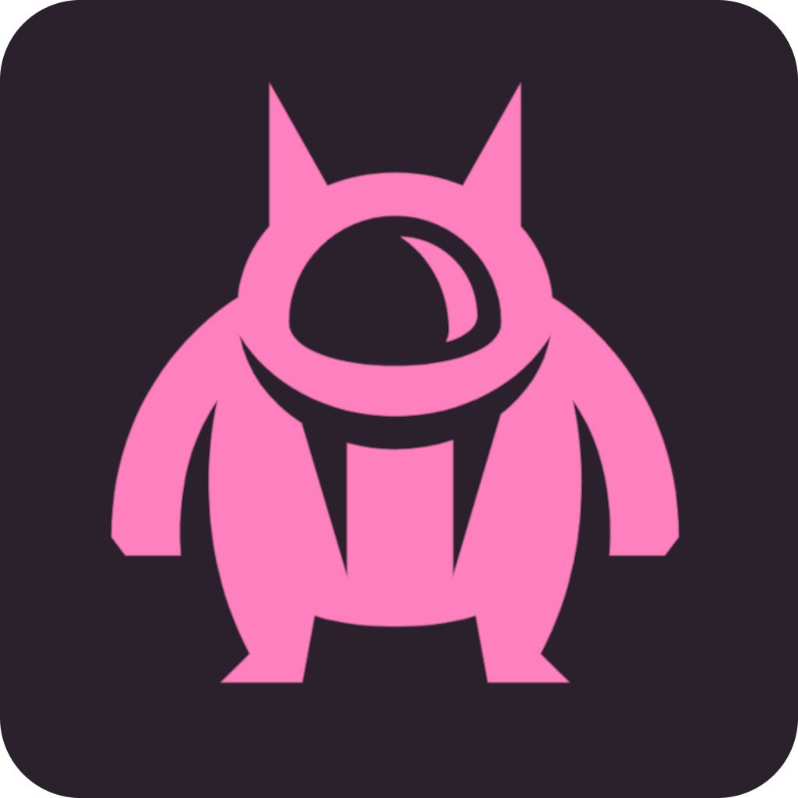

# Idea Eater

This application (supported primarily on MacOS) is designed to eat ideas so that you can get them out of your head when they might otherwise distract you.

If you've been puttering along, doing your work, and had a sudden idea about something unrelated - a task you need to do, a cool idea for a short story, the name of a song you've been trying to remember - you can feed it to the Idea Eating Monster, who will happily put it in a file called `ideas.txt` in your home directory for you.

At the end of your working period you can go and get all the ideas back out of the file and do whatever you want with them. The Idea Eater helps by storing the ideas for you until you're ready to get them back,so that they won't cause you to go down rabbit holes when you need to be doing other things.

---

This app was developed by [Matt Cengia](https://blog.mattcen.com/about/) and [Lilly Ryan](https://twitter.com/attacus_au) and is in a vague alpha state. Please feel free to suggest improvements if you have them!

The Idea Eater would not exist without the work of [Russell Keith-Magee](https://twitter.com/freakboy3742) and the fine apiarists of [The BeeWare Project](https://beeware.org/) who gave us [Toga](https://github.com/beeware/toga) (a Python native, OS native GUI toolkit), and [Briefcase](https://github.com/beeware/briefcase) (a tool for converting Python projects into standalone native applications). If you want to see more tools like these, please
consider [becoming a financial member of BeeWare](https://beeware.org/contributing/membership).

---

## How to build Idea Eater

Idea Eater requires **Python 3** and [Briefcase](https://github.com/beeware/briefcase).

If you want to build for platforms other than MacOS, please consult the [Briefcase docs](https://briefcase.readthedocs.io/en/latest/).

You can get started on MacOS by following these steps:

1) Clone this repo: `git clone git@github.com:attacus/idea-eater.git`
2) Create a Python virtual environment: `python3 -m venv beeware-venv`
3) Activate the virtual environment: `. beeware-venv/bin/activate`
4) Enter the project directory: `cd idea-eater/`
5) Install Briefcase in the virtual environment: `python -m pip install briefcase`
6) (If you want to do development work, you can run your project in a dev environment: `briefcase dev -d`)
7) Build the app: `briefcase build`
8) The standalone `Idea Eater.app` can now be found in `/macOS/app/Idea Eater/`
9) Om nom nom